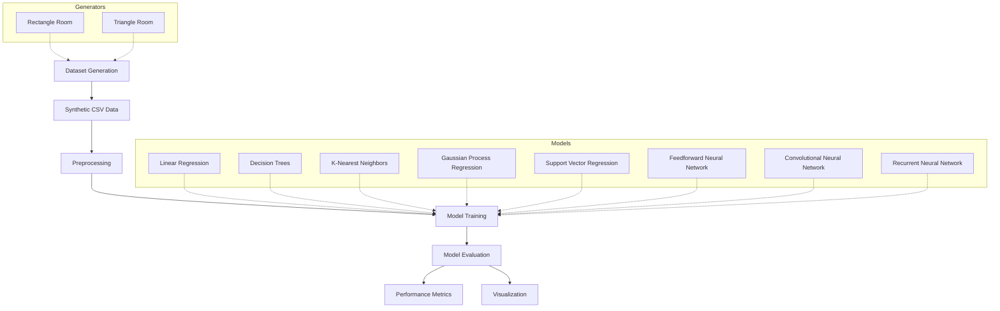

# Machine Learning-Based RSSI Prediction and Heatmap Generation

## Overview

This project explores the use of machine learning models to predict Received Signal Strength Index (RSSI) values in various indoor environments. Traditional empirical and deterministic models often struggle with environmental complexities or are computationally intensive. By employing machine learning, we can achieve fast and accurate approximations of signal strength, facilitating optimal network deployment and coverage planning for IoT devices and wireless networks.

The project involves generating synthetic datasets based on the log-distance path loss model and training several machine learning algorithms to predict RSSI at specific coordinates within a room.

## Project Architecture



## Dataset Generation

To generate experimental data, a log-distance path loss model is used. This approach provides a balance between simplicity and computational efficiency.

### Empirical Formula

The signal strength at a distance d is calculated as:

RSSI(d) = RSSI(d0) - 10n * log10(d / d0)

Where:
- RSSI(d) is the received signal strength at distance d.
- RSSI(d0) is the reference signal strength at distance d0 (e.g., -40 dBm at 1m).
- n is the path loss exponent (e.g., 2.5).
- d0 is the reference distance.

### Implementation Details

- Room Shapes: Rectangular (6x4 units) and Triangular (Base 6, Height 4).
- Reflection: The implementation supports recursive calculation of reflected paths (image reflection method) up to a specified maximum number of reflections.
- Samples: 1000 random coordinates are typically generated per dataset.

## Machine Learning Models

The project implements and compares several models:

- Linear Regression: A simple model for baseline performance.
- Decision Trees: Offers interpretability but may struggle with complex spatial relationships.
- K-Nearest Neighbors (KNN): Intuitive spatial prediction based on proximity.
- Gaussian Process Regression (GPR): Provides probabilistic estimates and excels in spatial correlations.
- Support Vector Regression (SVR): Effective for non-linear data in high-dimensional spaces.
- Feedforward Neural Networks (FNN): Multi-layer perceptrons with dropout for regularization.
- Convolutional Neural Networks (CNN): Deep architectures for capturing spatial features.
- Recurrent Neural Networks (RNN): LSTM-based models for sequential or pattern-based prediction.

## Results and Performance

Based on the evaluation of a rectangular room dataset, the following performance was observed:

| Model | MAE | MSE | RMSE | R2 Score |
| :--- | :--- | :--- | :--- | :--- |
| Gaussian Process Regression | 0.282 | 0.867 | 0.931 | 0.975 |
| K-Nearest Neighbors | 0.344 | 1.333 | 1.155 | 0.961 |
| Decision Trees | 0.549 | 1.729 | 1.315 | 0.949 |
| Support Vector Regression | 0.792 | 9.770 | 3.126 | 0.715 |
| Linear Regression | 3.840 | 31.677 | 5.628 | 0.075 |

Gaussian Process Regression demonstrated the highest accuracy (R2 = 0.975), indicating a superior fit for the spatial RSSI data.

## Installation

This project uses Poetry for dependency management.

1. Clone the repository.
2. Install dependencies:
   ```bash
   poetry install
   ```

## Usage

### Generate Data
Run the generator scripts to create datasets in the `data/` directory:
```bash
python RSSI/generators/rectangle.py
python RSSI/generators/triangle.py
```

### Train and Evaluate Models
Execute individual model scripts to train and visualize results:
```bash
python RSSI/models/gaussian_process_regression.py
python RSSI/models/k_nearest_neighbour.py
```

## Authors
- Harikeshav Rameshkumar
- Dr Venkatesh Ramaiyan